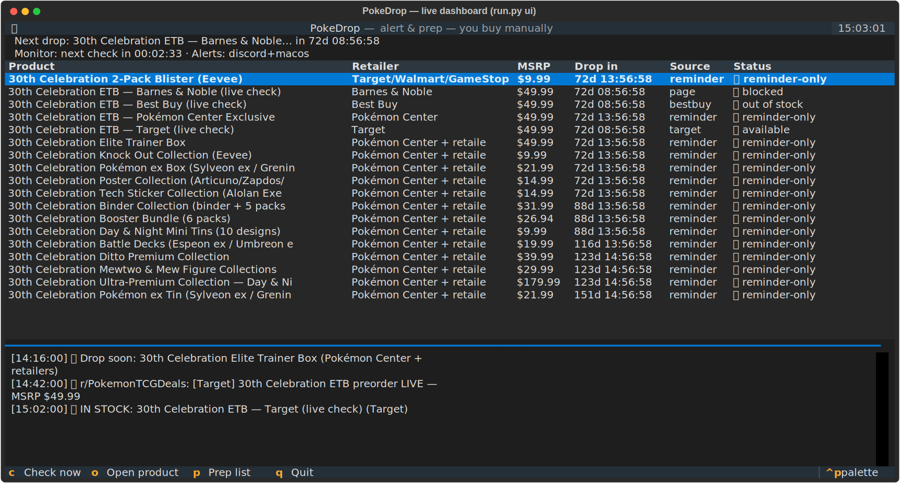
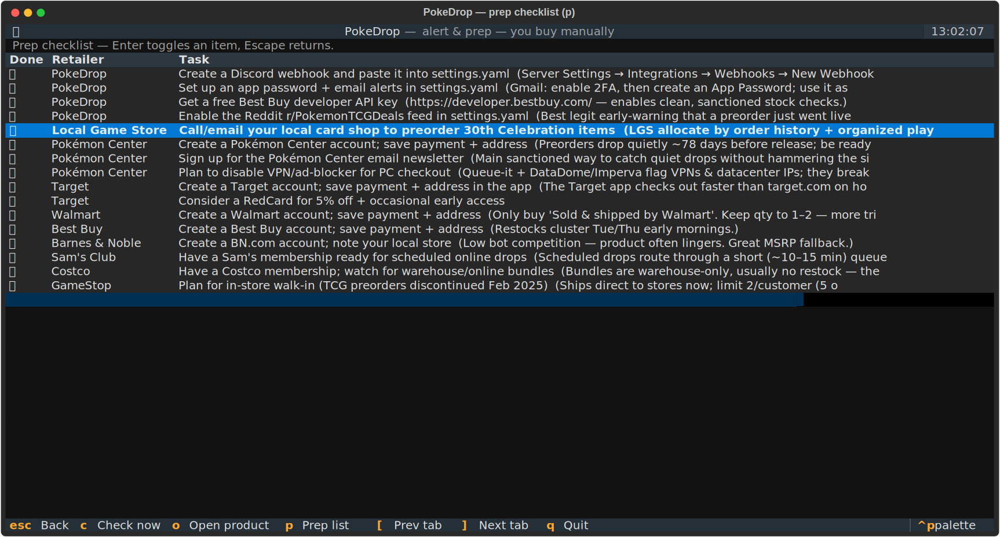
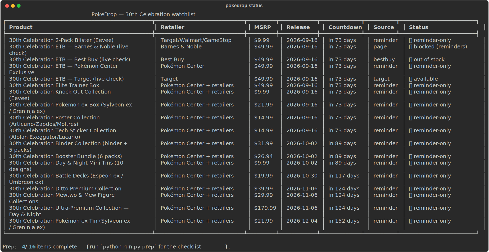

# PokeDrop User Guide

Everything in here is captured from the real tool — the images are actual SVG
screenshots exported from the running app (regenerate anytime with
`./.venv/bin/python scripts/make_screenshots.py`).

> **The one rule:** PokeDrop tells *you* when to buy and gets you ready to be fast.
> It never carts, checks out, creates accounts, or evades anti-bot systems.
> The screenshots below use staged demo data so every feature is visible.

---

## The live dashboard (`run.py ui`)



This is the main way to use PokeDrop day-to-day. Launch with:

```bash
./.venv/bin/python run.py ui
```

Reading the screen, top to bottom:

**Topline** — the two lines under the header:
- *Next drop* — the soonest upcoming release across your whole watchlist, with a
  live countdown ticking every second.
- *Monitor* — what the built-in monitor is doing: `next check in 00:02:33`,
  `checking now…`, or `auto-check off`. The monitor runs **inside** the TUI on
  your configured interval, so you don't need the separate daemon while it's open.
- *Alerts* — which channels are enabled (`discord+macos` above). If it says
  `NONE — edit settings.yaml!`, alerts are going nowhere; fix that first.

**Watchlist table** — one row per product-at-a-retailer:

| Column | Meaning |
|---|---|
| Product / Retailer / MSRP | What it is, where, and the price that counts as "not scalped" |
| Drop in | Live countdown to the drop (`72d 13:56:58`), `NOW` during the first hour, `past` after |
| Source | *How* it's checked: `reminder`, `target`, `bestbuy`, or `page` (see [Watchlist](#the-watchlist-configwatchlistyaml)) |
| Status | Latest check result — see below |

Statuses you'll see:
- 🟢 **available** — a live check just saw it buyable. *Go.*
- 🔴 **out of stock** — checked fine, not buyable yet.
- 🚧 **blocked** — the retailer refused the automated check (403/429/queue).
  PokeDrop backs off for `backoff_on_block_minutes` and relies on reminders —
  it never tries to sneak past.
- ⏰ **reminder-only** — never live-checked by design (Pokémon Center, Walmart,
  GameStop). Date reminders cover these.
- ⚪ **unknown** — not checked yet, or the page didn't match any keywords.
- ⏸ **disabled** — in the watchlist but turned off (`enabled: false`).

**Event feed** — the bottom panel. Every alert scrolls in as it happens and is
persisted to `data/events.jsonl`, so history survives restarts:
- 🟢 availability alerts (something flipped to buyable)
- ⏰ reminders (a drop is 24h / 1h / 10min away)
- 📣 Reddit matches (a r/PokemonTCGDeals post mentioned your keywords)
- ⚠️ alert-delivery failures (e.g. a bad Discord webhook) — so a silent
  misconfiguration can't cost you a drop

**Keys** (also shown in the footer):

| Key | Action |
|---|---|
| `c` | Run a check pass right now |
| `o` | Open the selected product's page in your browser |
| `p` | Prep checklist screen |
| `q` | Quit |

---

## The prep checklist (`p` in the TUI, or `run.py prep`)



Winning an MSRP drop is ~90% preparation. This screen tracks the account,
payment, and where-to-buy setup that makes your manual checkout take 20 seconds
instead of 3 minutes. **Enter** toggles an item done, **Escape** goes back.

The items encode the research on where boxes are actually won:

- **Local Game Store** — call/email to preorder. The calmest MSRP path; shops
  allocate by relationship, and there is no bot race at all.
- **Pokémon Center** — first-party MSRP. Preorders open quietly ~78 days before
  release; hyped drops go through a **randomized** queue (being early in line
  doesn't help — being *in* the queue does). Disable VPN/ad-blocker at checkout;
  their anti-bot stack flags both.
- **Target** — save payment + address in the **app**; it checks out faster than
  the website. RedCard gets 5% off and occasional early access.
- **Best Buy** — restocks cluster Tuesday/Thursday early mornings.
- **Barnes & Noble** — the sleeper: low bot competition, stock lingers for hours.
- **Walmart** — only buy "Sold & shipped by Walmart"; keep quantity to 1–2.
- **Sam's Club / Costco** — membership-gated scheduled drops and warehouse bundles.
- **GameStop** — walk-in only since Feb 2025 (TCG preorders discontinued).

Same list from the terminal: `run.py prep`, tick with
`run.py prep --done lgs-preorder`.

---

## CLI commands



| Command | What it does |
|---|---|
| `run.py ui` | The live dashboard above — recommended |
| `run.py status` | One-shot snapshot: the table in the screenshot |
| `run.py check` | Run a single check pass now; fires real alerts on changes |
| `run.py check --no-alerts` | **True dry run** — checks and prints, but writes nothing: no alerts, no state. Can never eat a reminder |
| `run.py watch` | Headless monitor loop (for launchd/cron) — don't run at the same time as `ui`, you'd get duplicate alerts |
| `run.py test-alerts` | Sends a test message to every enabled channel and reports per-channel success |
| `run.py dashboard` | Writes `data/dashboard.html` — a shareable static page with the watchlist + prep status |
| `run.py prep [--done ID / --undo ID]` | The checklist, in the terminal |
| `run.py list` | Compact list of watch ids (useful when editing the watchlist) |
| `run.py init` | First-time setup: copies the example configs into place |

---

## Alerts: where the pings go

Configured in `config/settings.yaml` under `alerts:`. Enable any combination;
every alert carries the product name, why it fired, MSRP, and the direct link.

**Discord** — richest and fastest. One-time setup:
1. In your server: *Server Settings → Integrations → Webhooks → New Webhook*.
2. Pick the channel, *Copy Webhook URL*.
3. Paste into `alerts.discord.webhook_url`, set `enabled: true`.
4. Optional: `mention: "<@YOUR_USER_ID>"` to get pinged hard.

**Email** — for when you're away from Discord. With Gmail:
1. Enable 2-factor auth, then create an **App Password**
   (myaccount.google.com → Security → App passwords).
2. `username`/`from_addr`: your address · `password`: the app password ·
   `to_addrs`: where to deliver · `enabled: true`.

**macOS notifications** — native Notification Center pop-ups with sound; on by
default (`alerts.macos.enabled`). Works from both the TUI and the daemon.

Always verify after editing: `run.py test-alerts`.

---

## The watchlist (`config/watchlist.yaml`)

Ships pre-loaded with all 15 confirmed **30th Celebration** products
(Sept 16 → Dec 4, 2026 waves). Anatomy of a watch:

```yaml
- id: etb-30th-target            # unique handle (shown in run.py list)
  name: "30th Celebration ETB — Target"
  retailer: "Target"
  source: target                 # HOW to check — see table below
  url: "https://www.target.com/p/.../A-93954435"
  tcin: "93954435"               # Target's product id (the A-number in the URL)
  msrp_usd: 49.99
  release_date: "2026-09-16"     # street date (drives the countdown)
  drop_time: "2026-09-16T08:00:00-04:00"   # when reminders fire from
  enabled: true
```

| `source` | Checked via | Needs |
|---|---|---|
| `reminder` | Nothing — date reminders only. For bot-fortressed retailers (Pokémon Center, Walmart, GameStop) | a `url` (never fetched — it's what the `o` key opens) + `drop_time`/`release_date` |
| `target` | Target's public RedSky fulfillment API | `tcin` |
| `bestbuy` | Best Buy's official developer API | `sku` + free API key in settings |
| `page` | Polite keyword check of the product page — only for low-protection sites (Barnes & Noble) | just the `url` |

**The workflow as preorders open:** most retailers haven't published product
pages yet, so most watches ship as `reminder`. When a page goes live: grab the
TCIN / SKU / URL, fill it into the matching disabled template at the bottom of
the watchlist, flip `enabled: true` — and that product gets real stock polling.
Set `drop_time` to the announced preorder-open moment; that's what the
24h / 1h / 10min reminders (configurable via `reminders.lead_times_minutes`)
count down to.

API details for each source, with docs links: [docs/APIS.md](APIS.md).

---

## Running it 24/7

Three options, pick one at a time (running two monitors = duplicate alerts):

1. **Keep the TUI open** — simplest; the monitor runs inside it.
2. **launchd (recommended for set-and-forget):**
   ```bash
   cp scripts/com.pokedrop.monitor.plist ~/Library/LaunchAgents/
   launchctl load ~/Library/LaunchAgents/com.pokedrop.monitor.plist
   ```
   Starts at login, auto-restarts on crash, logs to `data/monitor.log`.
   Unload with `launchctl unload …` before switching back to the TUI.
3. **cron** — run `run.py check` every few minutes.

---

## Data files (all local, all git-ignored)

| File | What it holds |
|---|---|
| `data/state.json` | Last status per watch, fired reminders, block backoffs |
| `data/events.jsonl` | Append-only alert history (the TUI feed reads this) |
| `data/prep.json` | Which prep items you've ticked |
| `data/dashboard.html` | The generated static dashboard |

Deleting `state.json` resets alert de-duplication (you may get one repeat alert
per product); deleting `events.jsonl` just clears the feed history.

---

## Troubleshooting

**A watch shows 🚧 blocked** — the retailer said no (403/429). This is expected
behavior, not a bug: PokeDrop backs off (`backoff_on_block_minutes`, default 60)
and the date reminders still cover you. If Target blocks persistently, raise
`poll_interval_seconds`.

**Reddit feed shows nothing / 403s** — unauthenticated Reddit access is often
blocked. Create a free "installed app" at https://www.reddit.com/prefs/apps and
put its `client_id` in `reddit_feed.client_id` (secret stays blank). PokeDrop
then uses sanctioned OAuth with much higher limits.

**Target checks suddenly error** — Target rotates its public web key
occasionally. Open any target.com product page with dev tools → Network, copy
the `key=` value from a `redsky.target.com` request, set it as
`target.web_key` in settings.

**Discord/email alerts not arriving** — run `run.py test-alerts` for a
per-channel verdict. Delivery failures also appear as ⚠️ events in the TUI feed.

**Duplicate alerts** — you're running the TUI and the `watch` daemon (or
launchd service) at the same time. Stop one.

**"Config error: missing config file"** — run `run.py init` to create
`config/settings.yaml` + `config/watchlist.yaml` from the examples.

---

## FAQ

**Why doesn't it just buy the box for me?**
Because that's the line between a stock alerter and a scalping bot. Automated
checkout violates every retailer's terms, is the target of anti-bot-purchasing
legislation, gets orders cancelled and accounts banned — and it's the arms race
that made these drops miserable in the first place. PokeDrop's bet: a human
alerted in the first seconds, with checkout pre-staged, is competitive at every
retailer that matters — and unbeatable at the calm ones (LGS, Barnes & Noble).

**Is the polling fair to the retailers?**
Yes, by design: it identifies itself honestly in its User-Agent, respects
robots.txt, polls on generous intervals with jitter, uses sanctioned APIs where
they exist, and backs off the moment a site objects instead of evading.

**How do I regenerate the screenshots in this guide?**
`./.venv/bin/python scripts/make_screenshots.py` — it stages demo data in a
temp directory (your real state is untouched) and re-exports the SVGs.
